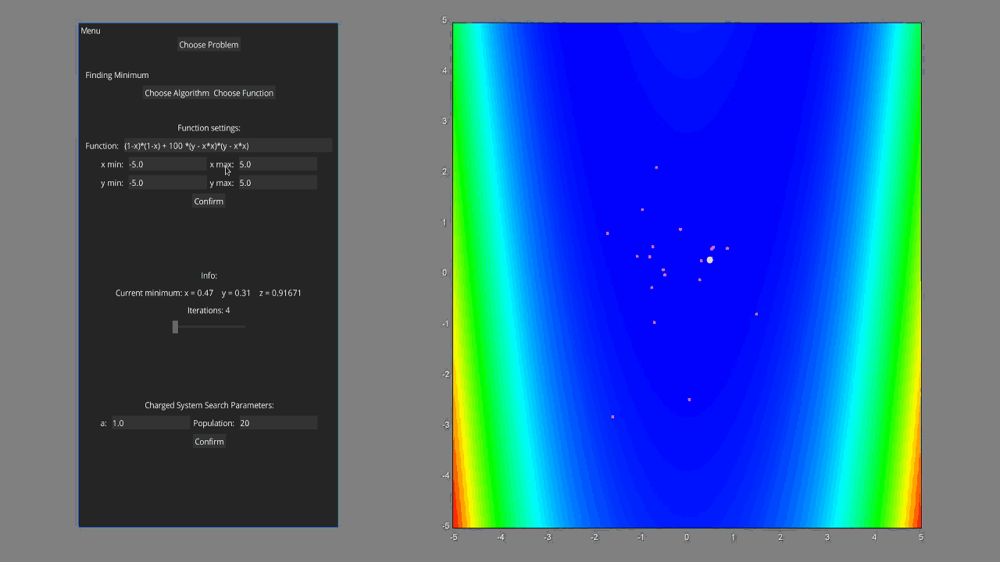
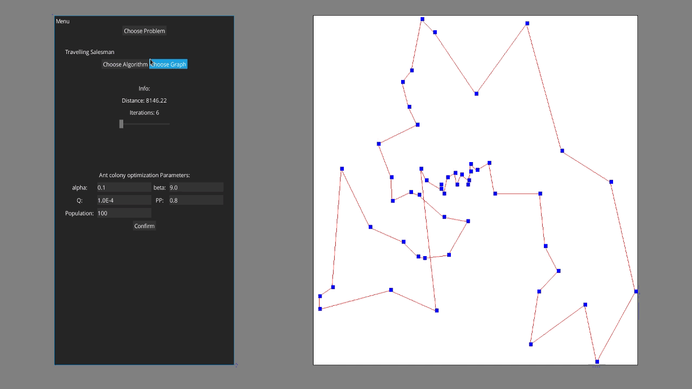

Optimization Methods
=============
Random generators:
-------
* Linear congruential generator
* Gaussian
* Levy flight

Minimum finding:
-------
* Simulated Annealing
* Firefly Algorithm
* Bat Algorithm
* Particle swarm optimization
* Evolution strategy
* Classic Genetic Algorithm
* Nelder-Mead method

Travelling salesman problem:
-------
* Ant colony optimization
* Intelligent water drops

